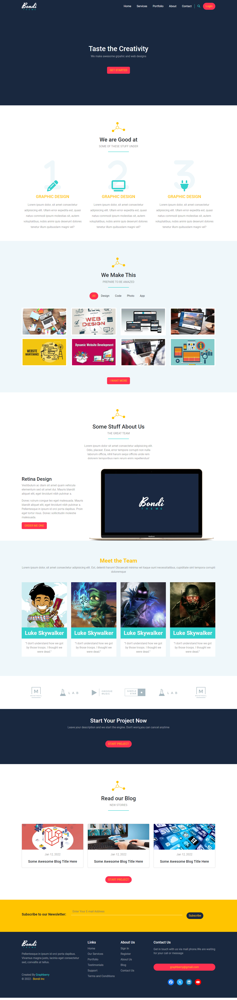

"

# Project Bondi

A responsive website template

## Screenshots

Screenshots are avaialable in the `Screenshots` folder.
Here's an example:

## Table of Contents

1. [Description](#description)
2. [Technologies](#Technologies)
3. [Features](#features)
4. [Contributing](#contributing)
5. [Acknowledgements](#acknowledgements)

## Description

A responsive website template , following tutorials from Elzero Web School YT channel.

### Technologies Used:

- **HTML**
- **CSS/SCSS**
- **JavaScript**
- **TypeScript**
- **Bootstrap**
- **Font Awesome**
- **Google Fonts**

## Features

Responsive layout
Dynamic form validation
Custom components with Bootstrap

## Contributing

If you'd like to contribute to this project, please follow these steps:

1. Fork the repository
2. Create your feature branch (git checkout -b feature-name)
3. Commit your changes (git commit -m 'Add new feature')
4. Push to the branch (git push origin feature-name)
5. Open a pull request

Please make sure your code follows the project's code style and includes tests where applicable.

## Acknowledgements

Bootstrap: Used for responsive layout and components.

Font Awesome: Used for icons.
Google Fonts: Used for Font.
